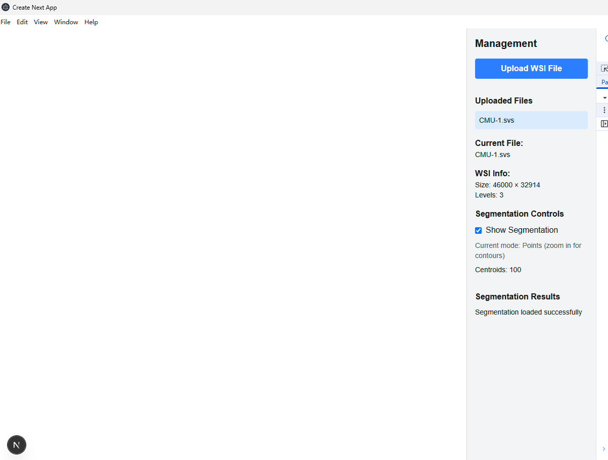

# WSI Processing System Issue

I sincerely apologize for the current issue with the **WSI processing system**: after uploading WSI files, the system shows no error and indicates successful segmentation, but **fails to display the images**.

I've attempted debugging through console.log, but due to time constraints, I haven't been able to fully resolve this issue.

## Current Status

The system currently:

* Successfully accepts WSI file uploads
* Shows a success message indicating completion
* Fails to render the processed images in the display area

